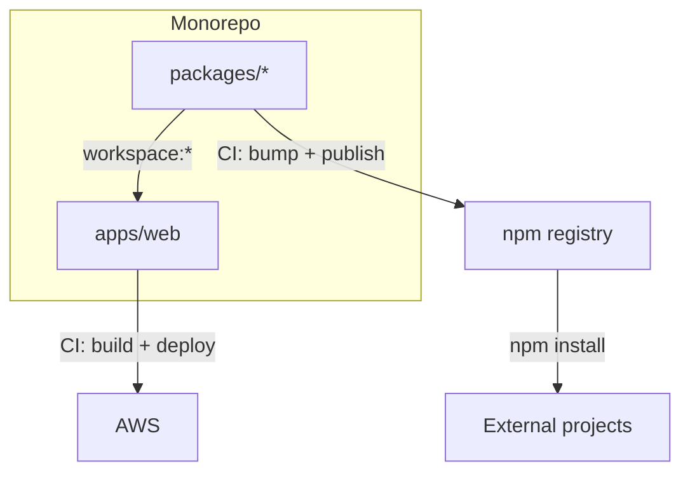

# Package CI

The web app imports SDK packages directly from the monorepo via workspace links, so changes are reflected instantly during development, while CI independently versions and publishes those same packages to npm for external consumers.

## How the web app consumes the packages

Packages are linked via `"workspace:*"` in `package.json`. The web app resolves `@monoframe/ui-atoms` and `@monoframe/ui-molecules` directly from the monorepo source - no npm download, no version mismatch, no publish-before-you-can-dev.

## How the packages get deployed to NPM

A manual GitHub Actions dispatch bumps semver (patch/minor/major) across all publishable packages, builds them, and publishes to the npm registry. External projects install the versioned packages from npm. The monorepo never consumes the published versions - it always uses the workspace source.
